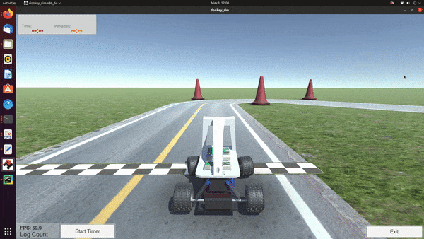

# Gail-Donkeycar 
Implementing deep IRL and GAIL based techniques in Donkeycar.

## Authors
Harshita Chaudhary  
Minh Dang  

## Requirements
Python version: 3.7

Library Packages: 
1. tensorflow
2. tensorboard
3. numpy
4. pandas
5. donkeycar
6. gym-donkeycar
7. opencv
8. urllib3
9. scikit-learn
10. scikit-image
11. requests
12. pillow
13. picamera
14. h5py
15. mpi4py
16. matplotlib
17. jaxlib
  

## Running the project

### Generating Expert Trajactories:

1. Install donkey package
2. Download Donkeycar simulator application
3. Create car using the command `donkey createcar --path ~/mycar`
4. Go to the directory using command `cd ~/mycar`
5. Edit myconfig.py and add the following variables to enable donkey gym simulator wrapper(replace <path_to_simulator_app>):

    DONKEY_GYM = True
    
    DONKEY_SIM_PATH = "<path_to_simulator_app>/donkey_sim.x86_64"
    
    DONKEY_GYM_ENV_NAME = "donkey-generated-track-v0"
    
7. Start the simulator using `python manage.py drive`
8. Drive using the web interface: localhost:8887/drive
9. Images are saved in data/images and catalog files are saved in data/
10. Run `python create_expert_dataset.py` to get expert trajectory in.npz format.

### Running approach 1:
Use the following command:
    `python trainPPOandGAIL.py`

### Running approach 2:
Use the following command:
    `python trainOnlyGail.py`

### Running pretrained model
Use the following command:
    `python runDonkey.py`

The pretrained model can be found here:

## Acknowledgements
The base source code has been taken from stable-baselines repository: https://github.com/hill-a/stable-baselines.  
Segmentation idea has been taken from: https://flyyufelix.github.io/2018/09/11/donkey-rl-simulation.html.  
